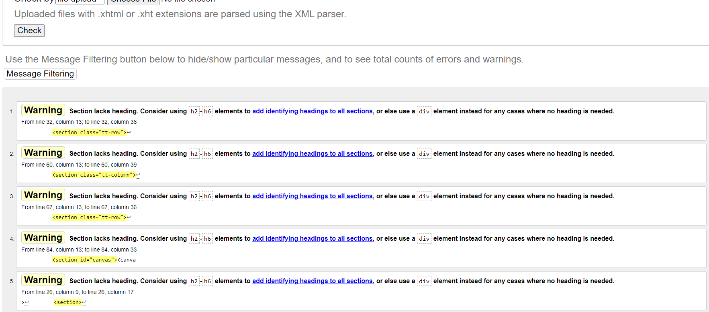

## README

webiste ( https://studenter.miun.se/~moda2202/dt146g/project/ )
This README shows the steps are necessary to create the webpage.

## Environment & Tools

- WebStorm 2022.2.3
- Visual Studio Code
- git version 2.38.1.windows.1
- Windows 11 Home
- Google Chrome browser

## Purpose

* The purpose of this code is to create a typing speed test page. The page includes a header with a logo and title, a main content section with various elements such as a form for selecting text and setting options, a section for displaying text content, a form for entering text and a button for starting/stopping the game, and a section for displaying a canvas element for rendering a graph and a list of result details. The page also includes a footer with copyright information. The code is written in HTML and CSS and uses JavaScript for functionality. The page allows users to select a piece of text, choose a language, and set options such as ignoring casing. The user can then start the game by pressing the play button and type the text into the input field. The page tracks the user's progress and displays the results in terms of gross words per minute (WPM), errors made, net WPM, and accuracy. The results are also displayed on a graph.

## Procedures

I started creating the project with the HTML page, so that the header, main, and footer were created, after that an image and title were placed inside the header.

Then it was possible to put 6 section elements inside the main, where the first section was placed inside the select element so that it contains the option to specify the text that will be worked on.

In the second section, three input options were placed to specify the language that will determine the type of texts that will be loaded into the select element, either English or Swedish, and also the third option that will be responsible for ignore casing.

As for the third section, it contains two elements, h2 and h3, so that the name of the text that will be selected will be placed inside the element h2, while h3 will put information about the writer, the number of letters and words of the text that will be selected.In addition to that, the p element (Paragraph) will be placed so that it will contain the text that will be worked on.

As for the fourth section, the input element and the button element were placed inside it, so that words are entered by the user through this element, and the game is also stopped and started through the button

As for the fifth section, a list was added in which the results of the game will be placed
The sixth section will contain the canvas element.

----------------------------
The CSS code for the typing speed test page styles the layout and appearance of the HTML elements on the page.

First, it defines several @font-face rules for importing custom fonts from local files. It then sets the default font for the body element and sets the background image and size for the body element.

The code styles the header element by setting the padding, background color, box shadow, and border radius. It also styles the h1 element within the header by setting the font family and adding an animation that changes the color of the text over time.

The code styles the main section element by setting the text alignment, background color, box shadow, border radius, margin, padding, font family, and minimum height. It also styles the h3 element within the main section by setting the font family and size.

The footer element is styled by setting the width, position, padding, font size, font weight, background color, box shadow, border radius, color, text alignment, and height.

The play/stop button is styled by setting the margin, background image, width, height, border, cursor, and font size. The dropdown menu is styled by setting the width, margin, text alignment, width, border, padding, and background color. The input field is styled by setting the width, margin, text alignment, width, border, padding, and background color.

The canvas element is styled by setting the width and height. The result details element is styled by setting the display, padding, and align-content properties. The list items within the result details element are styled by setting the font family and size.

the CSS code for the typing speed test page helps to make the page visually appealing and easy to read by setting appropriate font families and sizes, applying styling to various elements to create a cohesive layout, and adding some visual effects such as box shadows and text animations. It also helps to make the page responsive by setting the width and height of certain elements as percentages, which allows them to adjust to the size of the viewport.

---------------------------

The JavaScript code for the typing speed test page performs several functions to make the game work.

First, it defines several variables for storing elements from the HTML page such as the start button, the text field, the input field, the dropdown menu, and the canvas element. It also defines variables for storing data such as the selected text, the elapsed time, the number of characters typed, and the number of mistakes made.

Next, the code sets up an event listener for the start button that listens for clicks. When the button is clicked, the code checks the value of the button to determine whether the game is starting or stopping. If the game is starting, it downloads the texts from an XML file and populates the dropdown menu with them. It then sets the value of the start button to "stop" and starts the game by calling the main() function. If the game is stopping, the code clears the interval that is running the game and resets the values of the variables to their default values.

The main() function is the main function that runs the game. It sets the focus to the input field so that the user can start typing immediately. It also sets an interval that runs the update() function every 100 milliseconds. The update() function updates the elapsed time, calculates the results, and displays them on the page. It also updates the graph on the canvas element to show the progress of the game.

The downloadData() function downloads the texts from the XML file and stores them in an array. The selectlanguage() function filters the texts by language and populates the dropdown menu with the ones that match the selected language. The clearGame() function resets the values of the variables to their default values and clears the interval that is running the game.

The code also defines several functions for calculating the results of the game such as the gross words per minute (WPM), the net WPM, and the accuracy. These functions use the elapsed time, the number of characters typed, and the number of mistakes made to calculate the results and display them on the page.

Finally, the code defines a function for drawing the graph on the canvas element. It uses the elapsed time and the number of characters typed to draw a line on the canvas that shows the progress of the game.

Overall, the JavaScript code for the typing speed test page provides the functionality for starting and stopping the game, downloading and displaying the texts, calculating and displaying the results, and drawing the progress graph.

when using the https://validator.w3.org the result was:

There are no errors, but there are some warnings about it being preferable to use subheadings when using the section element, and it is preferable to use the div in the event that you do not want to use subheadings, but since it is according to the requirements of the project, it is an attempt to avoid the use of the div, so it was not used.

---------------------------

## Discussion    

Overall, the code seems functional but could benefit from some refactoring to make it more concise and easier to understand. For example, the selectlanguage function could be simplified by using a loop to add the options instead of multiple if statements, and the main function could be broken down into smaller, more focused functions. Additionally, using modern JavaScript features like template literals and the forEach method can make the code more readable and maintainable.

the code appears to be well-structured and easy to read, with clear and concise comments providing information about the purpose of each section and element.
